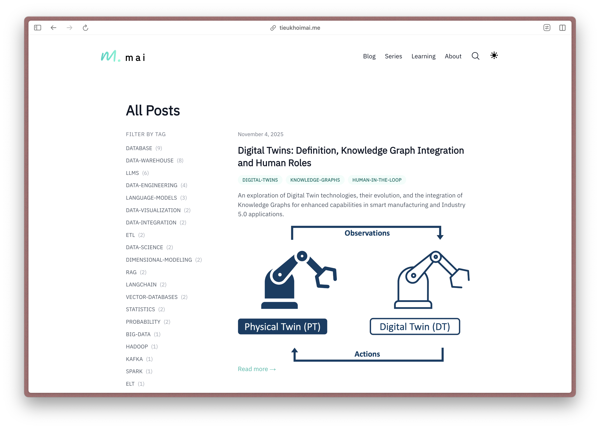
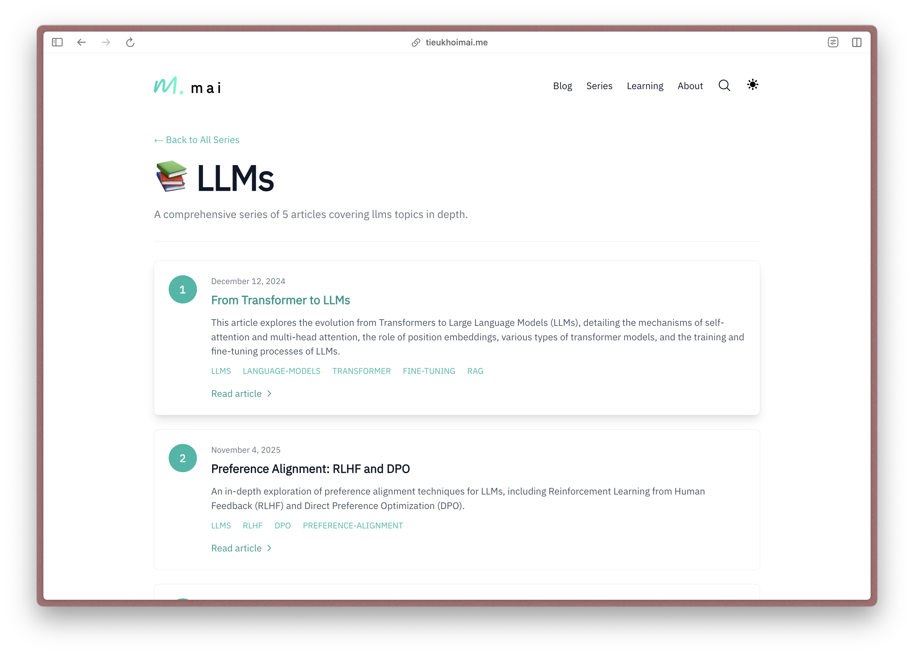
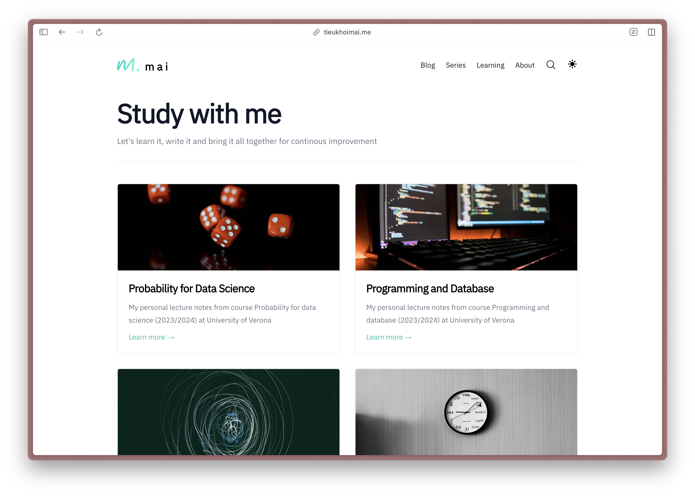
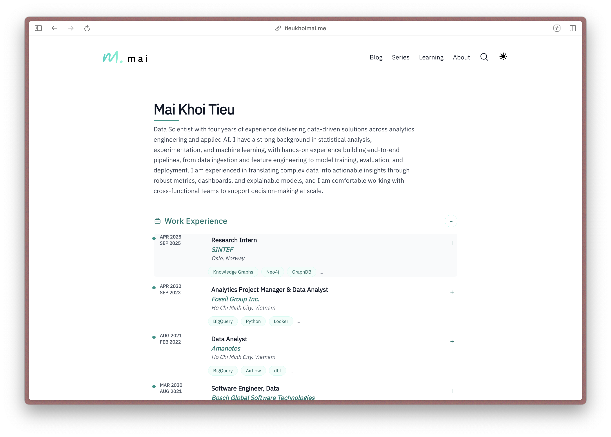

# mia-blog-v3

Personal blog built with Next.js App Router, Tailwind CSS, MDX via Contentlayer, and Pliny components. Comments (Giscus) and Google Analytics are optional and controlled through environment variables.

## Screenshots

| Blog                                               | Series                                                 |
| -------------------------------------------------- | ------------------------------------------------------ |
|  |  |

| Learning                                                   | Resume                                                 |
| ---------------------------------------------------------- | ------------------------------------------------------ |
|  |  |

## Stack

- Next.js 14 (App Router) + React 18
- Tailwind CSS 3 with typography/forms and custom Prism styles
- MDX powered by Contentlayer2 + Pliny components
- kbar search, RSS/sitemap generation, KaTeX math support
- Optional Google Analytics (GA4) and Giscus comments

## Requirements

- Node.js 18 or newer
- Yarn 3.6+ (Corepack recommended: `corepack enable`)

## Quick start

1. Clone the repository:

   ```bash
   git clone https://github.com/tieukhoimai/mia-blog-v3
   cd mia-blog-v3
   ```

2. Install dependencies:

   ```bash
   yarn install
   ```

3. Configure environment variables (optional features):
   - Create `.env.local` manually or pull from Vercel: `vercel env pull .env.local`
   - Use the sample below and remove what you do not need:

   ```bash
   # Google Analytics (GA4)
   NEXT_PUBLIC_GOOGLE_ANALYTICS=G-XXXXXXXXXX

   # Giscus comments
   NEXT_PUBLIC_GISCUS_REPO=owner/repo
   NEXT_PUBLIC_GISCUS_REPOSITORY_ID=
   NEXT_PUBLIC_GISCUS_CATEGORY=Announcements
   NEXT_PUBLIC_GISCUS_CATEGORY_ID=
   ```

4. Run the development server:

   ```bash
   yarn dev
   ```

   Then open http://localhost:3000.

## Customization

- Site metadata, analytics/comments/newsletter providers: data/siteMetadata.js
- Navigation links: data/headerNavLinks.ts
- Projects: data/projectsData.ts
- Author profile: data/authors/default.mdx
- Blog posts (MDX): data/blog/
- Blog list page size/title: app/blog/page.tsx (adjust POSTS_PER_PAGE or heading)
- Resume page data source: app/resume/page.tsx (replace fetch URL with your JSON); tweak layout/sections in app/resume/ResumeClient.tsx
- Update the content security policy in next.config.js if you add other analytics or comment providers.

## Scripts

- `yarn dev` – start the local dev server
- `yarn build` – production build + postbuild generators (tags, series, search index, contentlayer fixes)
- `yarn serve` – serve the production build
- `yarn lint` – lint sources (App Router, components, lib, layouts, scripts)
- `yarn analyze` – bundle analyzer build

## Deploy

Deploy on Vercel (recommended). Set the same environment variables used locally.

## Previous version

This is the second version of my website. Previous version: https://mia-blog.vercel.app

## Credits

Forked from [Tailwind nextjs starter blog template](https://github.com/timlrx/tailwind-nextjs-starter-blog).
