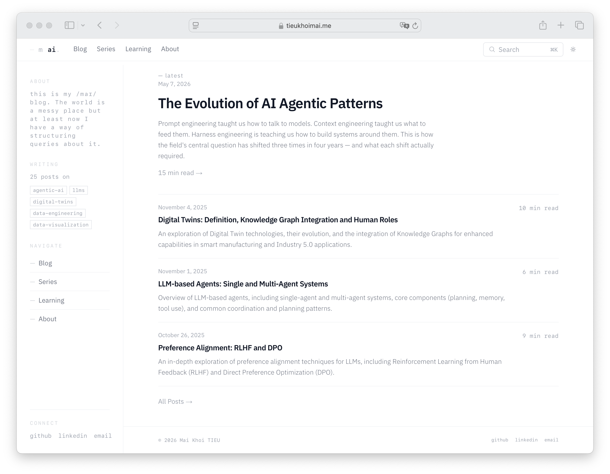
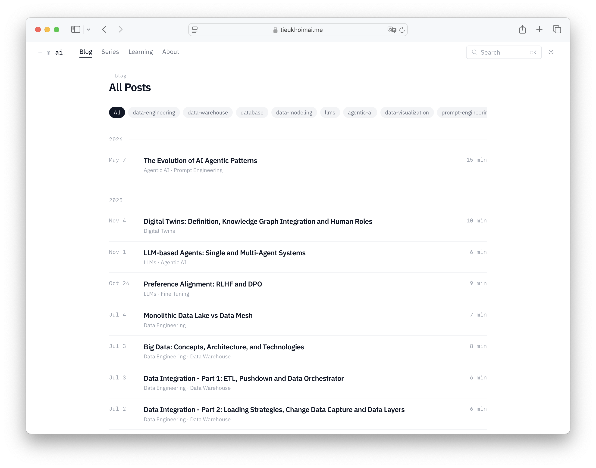
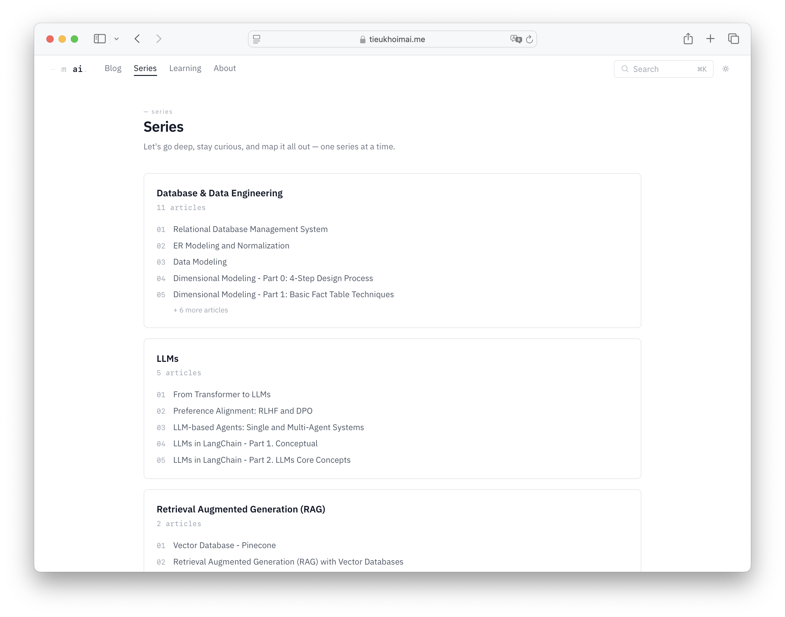
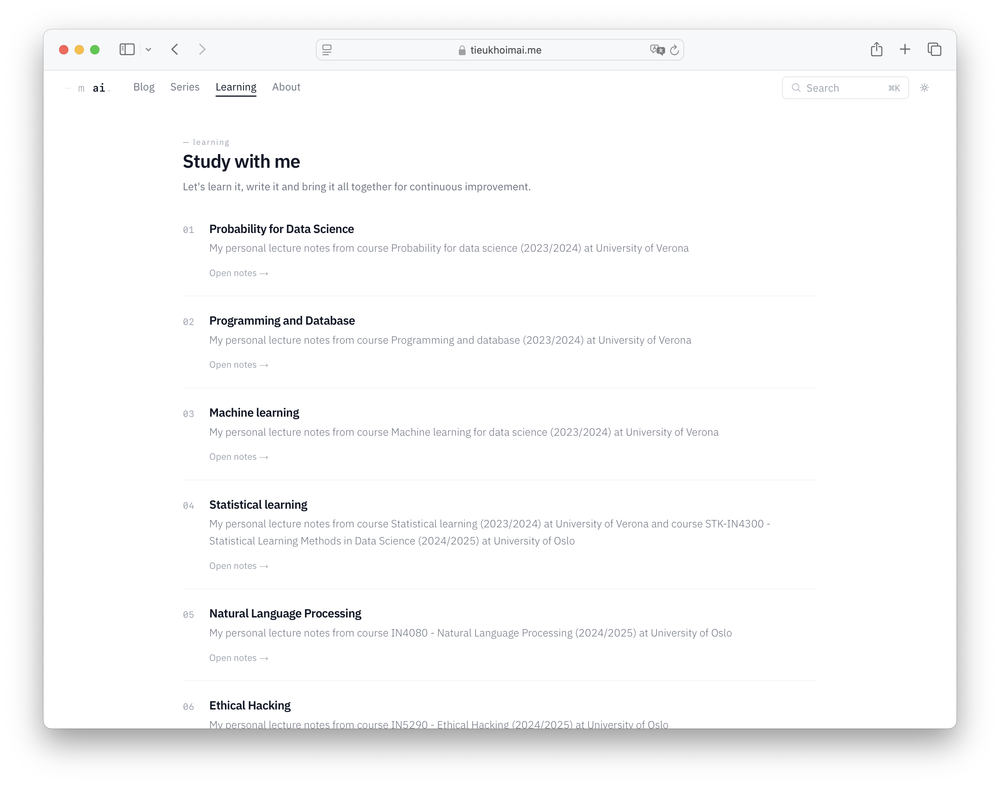
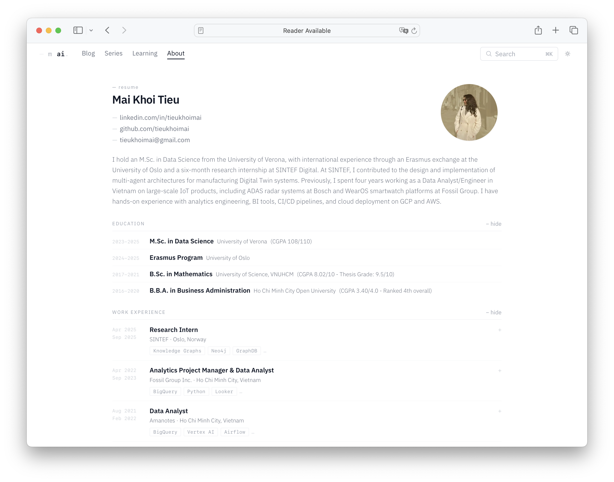

# mia-blog-v3

Personal blog built with Next.js App Router, Tailwind CSS, and MDX via Contentlayer. Covers writing, data engineering, and ML topics at [tieukhoimai.me](https://tieukhoimai.me).

## Screenshots

| Home                                               |
| -------------------------------------------------- |
|  |

| Blog                                               | Series                                                 |
| -------------------------------------------------- | ------------------------------------------------------ |
|  |  |

| Learning                                                   | Resume                                                 |
| ---------------------------------------------------------- | ------------------------------------------------------ |
|  |  |

## Stack

- **Framework**: Next.js 15 (App Router) + React 18
- **Content**: MDX via Contentlayer2 — blog posts, series, authors
- **Styling**: Tailwind CSS 3, IBM Plex Sans, custom type scale
- **Search**: KBar (local, `⌘K`) — optional Algolia
- **Comments**: Giscus (GitHub Discussions) — optional
- **Analytics**: Google Analytics (GA4) — optional
- **Dark mode**: next-themes (system / manual toggle)

## Pages

| Route            | Description                                            |
| ---------------- | ------------------------------------------------------ |
| `/`              | Homepage — featured post + recent posts editorial list |
| `/blog`          | Year-grouped archive with tag filters                  |
| `/blog/[slug]`   | Post with sticky table of contents and Giscus comments |
| `/series`        | All article series                                     |
| `/series/[slug]` | Ordered articles within a series                       |
| `/learning`      | Curated external resources and courses                 |
| `/about`         | Biography — pulls live from resume JSON                |
| `/resume`        | Full interactive CV with collapsible sections          |
| `/tags/[tag]`    | Posts filtered by tag                                  |

## Features

- **Identity panel** — sticky sidebar on the homepage showing site description, topic tags, navigation, and social links; collapses on mobile
- **Series** — group posts with `series` + `seriesOrder` frontmatter; ordered list auto-generated at build time
- **Table of contents** — extracted from headings, sticky on desktop, collapsible drawer on mobile
- **KBar search** — full-text local search indexed at build time; opens with `⌘K` or the header pill
- **Reading time** — computed per post by Contentlayer
- **KaTeX math** — render equations in MDX with `$...$` or `$$...$$`
- **Code highlighting** — Prism Plus with line numbers and titles
- **Resume** — modular, collapsible sections; fetched from external JSON; print-friendly
- **RSS + sitemap** — generated at build time

## Requirements

- Node.js 18 or newer
- Yarn 3.6+ (`corepack enable`)

## Quick start

```bash
git clone https://github.com/tieukhoimai/mia-blog-v3
cd mia-blog-v3
yarn install
yarn dev          # http://localhost:3000
```

### Environment variables (all optional)

Create `.env.local` and add only what you need:

```bash
# Google Analytics
NEXT_PUBLIC_GOOGLE_ANALYTICS=G-XXXXXXXXXX

# Giscus comments — generate config at https://giscus.app
NEXT_PUBLIC_GISCUS_REPO=owner/repo
NEXT_PUBLIC_GISCUS_REPOSITORY_ID=
NEXT_PUBLIC_GISCUS_CATEGORY=Announcements
NEXT_PUBLIC_GISCUS_CATEGORY_ID=
```

## Customization

| What                                                               | Where                                                                |
| ------------------------------------------------------------------ | -------------------------------------------------------------------- |
| Site title, URL, social links, search/comments/analytics providers | `data/siteMetadata.js`                                               |
| Navigation links                                                   | `data/headerNavLinks.ts`                                             |
| Learning page resources                                            | `data/projectsData.ts`                                               |
| Author profile                                                     | `data/authors/default.mdx`                                           |
| Identity panel topic tags                                          | `components/IdentityPanel.tsx`                                       |
| Resume data source                                                 | `app/resume/page.tsx` — replace the fetch URL with your own JSON     |
| Blog post list page size                                           | `app/blog/page.tsx` — adjust `POSTS_PER_PAGE`                        |
| Content security policy                                            | `next.config.js` — update when adding analytics or comment providers |

### Writing a blog post

Add an MDX file to `data/blog/` with this frontmatter:

```mdx
---
title: 'Post title'
date: '2026-01-01'
tags: ['data-engineering']
summary: 'One-line summary shown in listings.'
image: '/static/images/posts/your-cover.png'
---
```

To add a post to a series:

```mdx
---
series: 'Series name'
seriesOrder: 1
---
```

## Scripts

```bash
yarn dev       # start dev server at localhost:3000
yarn build     # production build + postbuild generators
yarn serve     # serve production build locally
yarn lint      # ESLint --fix on app/, components/, lib/, layouts/, scripts/
yarn analyze   # bundle analyzer build (set ANALYZE=true)
```

The `yarn build` postbuild step generates:

- `app/tag-data.json` — tag counts
- `app/series-data.json` + `public/series-data.json` — series groupings
- `public/search.json` — KBar search index

These files are auto-generated — do not edit them directly.

## Deploy

Deploy on Vercel (recommended). Set the same environment variables used locally.
